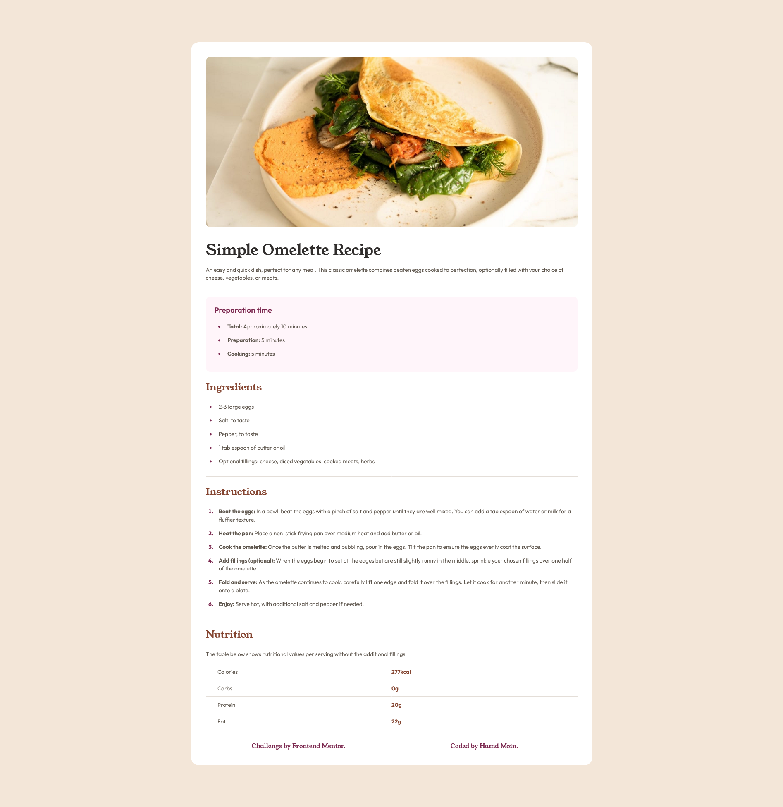
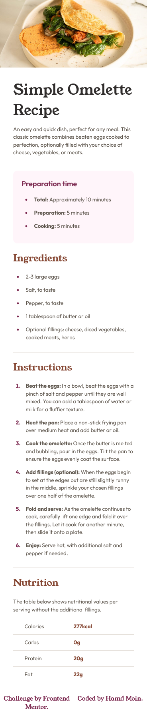

# Frontend Mentor - Recipe page solution

This is a solution to the [Recipe page challenge on Frontend Mentor](https://www.frontendmentor.io/challenges/recipe-page-KiTsR8QQKm). Frontend Mentor challenges help you improve your coding skills by building realistic projects. 

## Table of contents

- [Overview](#overview)
  - [Screenshot](#screenshot)
  - [Links](#links)
- [My process](#my-process)
  - [Built with](#built-with)
  - [What I learned](#what-i-learned)
  - [Useful resources](#useful-resources)
- [Author](#author)

## Overview

### Screenshot

#### Desktop


#### Mobile


### Links

- Live Site URL: [https://hamdmoin.github.io/recipe-template/](https://hamdmoin.github.io/recipe-template/)

## My process

### Built with

- HTML5 markup
- CSS
- CSS Flexbox
- CSS media query

### What I learned

I learned what are media queries and their use in making responsive web pages 

#### Example of media queries being used in the solution:

```css
@media only screen and (min-width:376px)
{
  body{
    padding-bottom: 60px;
    padding-top: 60px;
  }
}
```

I also learned how to use and style &lt;ul> , &lt;ol> and &lt;li> tags in html and CSS

### Useful resources

- [Geeksforgeeks](https://www.geeksforgeeks.org) - This website helped me understand more about &lt;ul> and &lt;li> tags 
and also helped me in understanding media queries
- [Stack overflow](https://www.stackoverflow.com) - This website helped me in solving questions I had during the project

## Author

- Instagram - [@hamdmoin](https://www.instagram.com/hamdmoin/)
- Frontend Mentor - [@hamdmoin](https://www.frontendmentor.io/profile/hamdmoin)